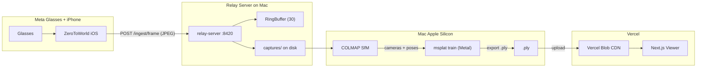

# GSplat 3D Reconstruction Pipeline

## Architecture




## Part 1: Frame accumulation on the relay server

Currently the relay stores only the last 30 frames in memory (RingBuffer). We need to persist every frame to disk during a session so we have enough images for COLMAP + training (typically 100-300+ images with good coverage).

Changes in [relay-server/src/routes/ingest.ts](relay-server/src/routes/ingest.ts):

- When a frame arrives at `POST /ingest/frame`, also write the raw JPEG to `relay-server/captures/<session-id>/images/<timestamp>_<id>.jpg`
- Add `POST /ingest/session/start` and `POST /ingest/session/stop` endpoints that create/close a session directory
- Add `GET /captures/:sessionId` to list accumulated frames and metadata
- Keep existing RingBuffer + WebSocket broadcast untouched

Changes in [relay-server/src/state.ts](relay-server/src/state.ts):

- Track `currentSessionId` and `sessionDir` path

## Part 2: COLMAP preprocessing

Create a script `scripts/run-colmap.sh` that:

1. Takes a session captures directory as input (e.g. `relay-server/captures/<session>/images/`)
2. Runs COLMAP feature extraction (SIFT), exhaustive matching, and sparse reconstruction
3. Outputs the COLMAP dataset in the standard format: `<session>/colmap/sparse/0/` with `cameras.bin`, `images.bin`, `points3D.bin`

COLMAP runs on CPU by default (fine for Apple Silicon). Install via `brew install colmap`.

## Part 3: msplat training (local, Apple Silicon)

**msplat** (`pip install msplat`) is a Metal-accelerated Gaussian Splatting engine built for Apple Silicon. No CUDA needed. Trains a full scene in ~80 seconds on M4 Max, exports `.ply` directly.

Create a script `scripts/train-splat.sh` that:

1. Takes the COLMAP output directory
2. Runs msplat training via the CLI or Python:

```python
import msplat

dataset = msplat.load_dataset("captures/<session>/", eval_mode=False)
config = msplat.TrainingConfig(iterations=7000, num_downscales=0)
trainer = msplat.GaussianTrainer(dataset, config)
trainer.train(lambda s: print(f"step={s.iteration} splats={s.splat_count:,}"), callback_every=100)
trainer.export_ply("exports/<session>.ply")
```

1. Produces a `.ply` file ready for web viewing

Dependencies: Python 3.12+, msplat (pip), COLMAP (brew). macOS 14+, Apple Silicon.

## Part 4: Vercel-hosted Next.js splat viewer

Create a new `viewer/` directory at the repo root -- a Next.js app deployed on Vercel.

**Stack:**

- Next.js 15 (App Router)
- `@vercel/blob` for storing `.ply` / `.ksplat` files on Vercel's CDN (supports up to 5 TB, public URLs cached on CDN)
- `@mkkellogg/gaussian-splats-3d` (Three.js-based GSplat renderer, MIT, 5K weekly downloads, supports `.ply` / `.splat` / `.ksplat`)
- Three.js for the 3D canvas

**Pages:**

- `/` -- landing page listing available splat sessions/scenes
- `/view/[sessionId]` -- full-screen 3D splat viewer with orbit controls
- `/api/upload` -- server route for Vercel Blob client uploads (handles token exchange for files > 4.5 MB)

**Upload flow:**

- After training, run `scripts/upload-splat.ts` to push the `.ply` to Vercel Blob
- Or drag-and-drop through the viewer UI

**Viewer component:**

- Load `.ply` from Vercel Blob CDN URL
- Render with `GaussianSplats3D` Viewer in a React wrapper component
- Orbit controls, progressive loading, dark background

## Part 5: End-to-end workflow

1. Start relay (`npm run dev`), start session on iOS, walk around with Meta glasses
2. Frames accumulate in `relay-server/captures/<session>/images/`
3. Stop session. Run COLMAP: `./scripts/run-colmap.sh captures/<session>`
4. Train locally: `./scripts/train-splat.sh captures/<session>` (~80s on Apple Silicon)
5. Upload: `npx tsx scripts/upload-splat.ts exports/<session>.ply`
6. View at `https://zerotoworld.vercel.app/view/<session>`

## File structure (new files)

```
relay-server/
  src/routes/ingest.ts        (modified -- add disk persistence + session endpoints)
  src/state.ts                (modified -- track session)
  captures/                   (gitignored -- frame storage per session)

scripts/
  run-colmap.sh               (COLMAP preprocessing)
  train-splat.sh              (msplat training + .ply export)
  upload-splat.ts             (upload .ply to Vercel Blob)
  requirements.txt            (msplat, numpy)

viewer/                       (new Next.js app)
  package.json
  next.config.js
  app/
    layout.tsx
    page.tsx                  (scene gallery)
    view/[sessionId]/page.tsx (3D viewer)
    api/upload/route.ts       (Vercel Blob token exchange)
  components/
    SplatViewer.tsx            (GaussianSplats3D wrapper)
  lib/
    blob.ts                   (Vercel Blob helpers)
  .env.local                  (BLOB_READ_WRITE_TOKEN)
  vercel.json
```

